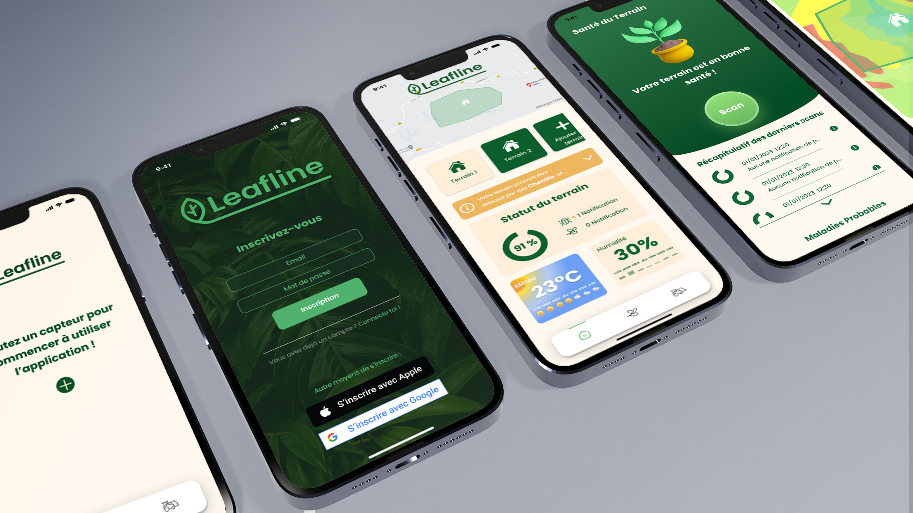

# Leafline 🌱

<div align="center" style="text-align: center;">
  
</div>

## Description 🔬

Leafline est une application utilisant l'IA et des capteurs IoT pour protéger les plantes en prévisualisant la météo. Les capteurs surveillent en temps réel l'humidité du sol, la température et l'intensité lumineuse. L'application analyse les données et les prévisions météorologiques pour avertir les utilisateurs des risques encourus par leurs plantes, tels que les maladies causées par la pluie. Des notifications et des conseils personnalisés sont fournis pour prendre des mesures préventives et préserver la santé des plantes.

## Checklist des fonctionnalités 📝

- Navigation (CustomTabBar) : ✔️
- Map : ❌
- Inscription et connexion : ❌
- Home : ❌
- Dashboard : ❌
- Settings : ❌

## Technologies 🛠

Les technologies suivantes ont été utilisées dans le développement de ce projet :

### Frontend 💻

- [Flutter](https://flutter.dev/) 
- Architecture: MVVM
- Services: Utilisé pour les appels API

## Normes de convention 📏

**Suivis de développement sur Jira Atlassian**

> _https://farming4cast.atlassian.net/jira/software/projects/LEAFLINE/boards/1_

## Installation et Commandes Utiles 📟

### Prérequis

- Assurez-vous d'avoir [Flutter](https://flutter.dev/docs/get-started/install) installé sur votre machine.
- Vérifiez la version de Flutter : `flutter --version`

### Commandes

- Cloner ce dépôt : `git clone [URL_DU_REPO]`
- Accéder au dossier du projet : `cd LeafLine`
- Installer les dépendances : `flutter pub get`
- Lancer l'application sur un émulateur ou un appareil physique : `flutter run`
- Pour construire l'application pour une release : `flutter build apk` (pour Android) ou `flutter build ios` (pour iOS).

## Running Tests 🧪

Pour exécuter les tests, utilisez cette commande :

```bash
  flutter test
```

##
